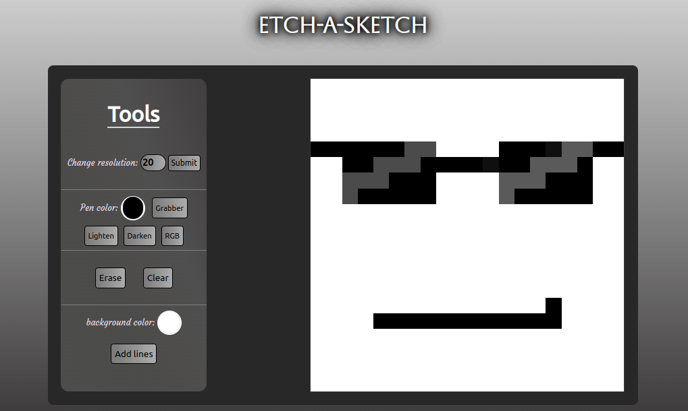

# Etch-a-Sketch
## Result

[LIVE DEMO](https://silva-mo.github.io/Etch-a-Sketch/)

## About
this is my fourth TOP's project, this project mainly focuses on JavaScript DOM manipulation skills.

Alhamdulillah

## Skills and features needed in this project
- Problem-solving skills
- JavaScript DOM manipulation skills
- Flexbox and Grid CSS manipulation skills

## Challenges that I've overcame
- Dealing with JS Event Listeners 
- Using the CSS Grid feature

